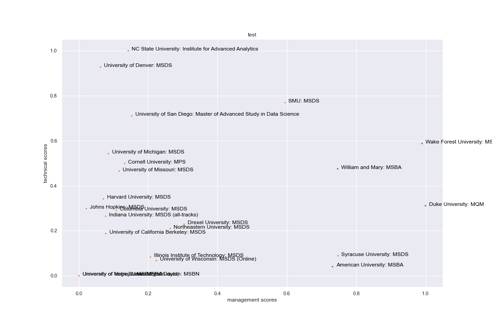

# Data Science Program Comparison

Most universities have a data science program. Some are part of the school's business school, some are part of computer science colleges, and some have developed their own analytics institutes. As a result, not all programs offer the same level of training in technical skillsets and business acumen. I am interested quantifying the levels of technical and business training for each program. The result of this analysis is a tool prospective students can use to help decide which data science program is right for them.

## The Data

The data used in this analysis was scrapped from each program's curriculum page. After all the html was collected, I processed the text for analysis. Processing included removing all punctuation, removing all stop words, tokenizing each word, and finally steming the tokens. Next, I compiled libraries of words used to describe technical training (advanced analytics, machine learning, and deep learning) and traditional business course material. I then counted how many tokens in each program's corpus appeared in one of these dictionaries.

## Analysis

I then divided each programs count of technical and business training tokens by the total number of tokens in that program's curriculum corpus. Finally, I normalized the scores for all programs.

